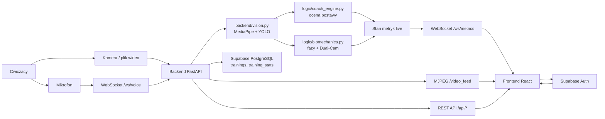
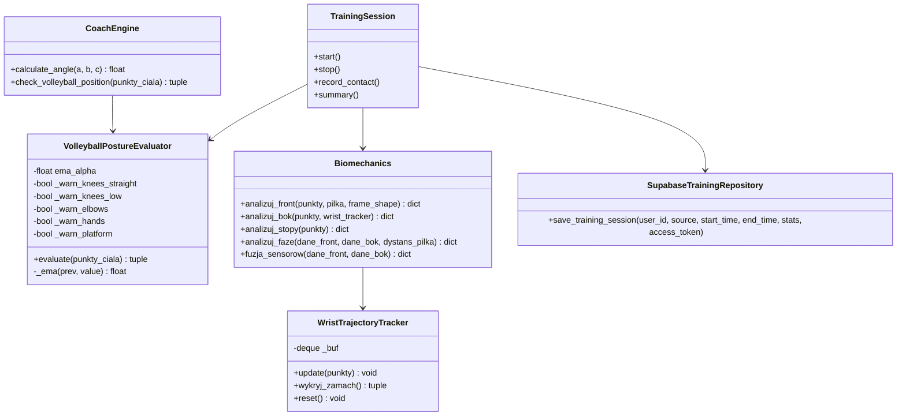
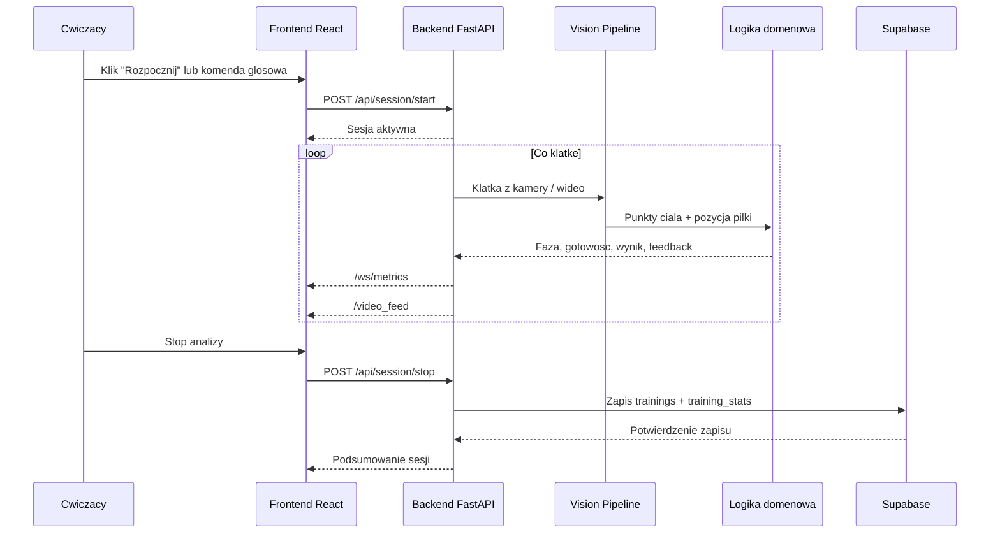
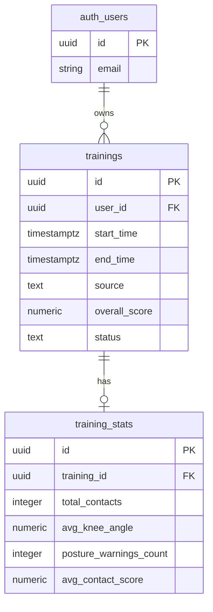

# Cyber Trener - wysokopoziomowe diagramy UML

Diagramy zapisano w formacie Mermaid, aby mozna je bylo wyswietlic bezposrednio w GitHubie albo skopiowac do narzedzia generujacego obrazki do prezentacji.

## 1. Diagram komponentow

## 2. Diagram klas domeny i logiki

## 3. Diagram sekwencji - analiza jednego odbicia

## 4. Diagram modelu danych Supabase

## 5. Mapowanie diagramow na pliki projektu

| Element diagramu | Pliki w repozytorium |
| --- | --- |
| Backend FastAPI | `server.py`, `backend/app.py`, `backend/routes.py` |
| Vision Pipeline | `backend/vision.py`, `backend/streams.py` |
| Logika domenowa | `logic/coach_engine.py`, `logic/biomechanics.py` |
| Sesja treningowa | `backend/training_session.py`, `backend/state.py` |
| Frontend React | `frontend/src/pages/LiveAnalysis.tsx`, `frontend/src/components/live/*` |
| Sterowanie glosowe | `audio/speech_recognition.py`, `frontend/src/voice/*` |
| Supabase | `backend/supabase_client.py`, `frontend/src/lib/trainingData.ts` |

